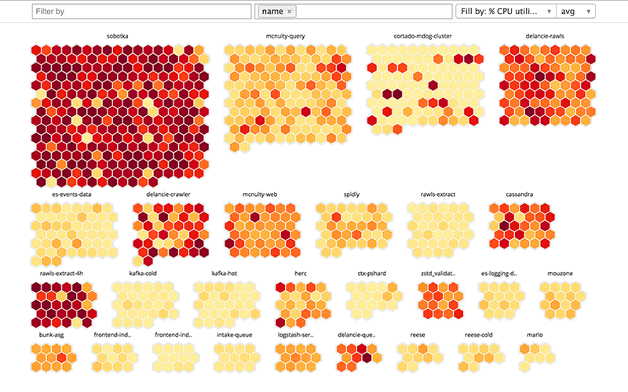

# HoxHunt HeatMap exercise

## Acknowledgement

If you encounter any issues with these instructions or the framework, or anything really, do not hesitate to contact us! Even though this is an individual assignment, the team is here to help.


## Assignment

At HoxHunt we deal with large sets of data. In this exercise you will enhance and implement a heat map visualization of user risk associated to social engineering. You'll have a data set containing a list of users with a `failureRate` ranging from 0.0 to 1.0 and `department` parameter (e.g. "sales") which can be used to split the users in to groups.

Your task is to process the data and modify the visualization so our customers can have a nice per department view of their weak points. Here is an example from another problem domain:



You can use this idea or change the approach for the visualization all together!

Best thing is first to run the application as per instructions below, test the API e.g. `localhost:3001/api/users` to see what data is coming out and then look at following files:

- `server.js`
- `processData.js`
- `client/src/App.js`
- `client/src/Client.js`
- `client/src/Grid.js`

### Things we are looking for in the submission

Overall you should think the submission as a real feature going out to our customers. Here are the key points we're looking for:

- Visualization per organization
  - Consider decimating and pre-processing the data in the backend. E.g. we currently send all the data (11k samples) to the client. We could just decimate the whole dataset to max 1K in a manner that preserves visually descriptive properties (E.g. essentially do a histogram). 
- Nice user interface
- Unit tests

## Running locally

Use Node 8 or greater.

```
npm i

cd client
npm i

cd ..
npm start
```

## Run Tests

Run once:
```
npm test
```
or to watch for changes
```
npm run test:watch
```


## Overview

`create-react-app` configures a Webpack development server to run on `localhost:3000`. This development server will bundle all static assets located under `client/src/`. All requests to `localhost:3000` will serve `client/index.html` which will include Webpack's `bundle.js`.

To prevent any issues with CORS, the user's browser will communicate exclusively with the Webpack development server.

Inside `Client.js`, we use Fetch to make a request to the API:

```js
// Inside Client.js
return fetch(`/api/users`, {
  // ...
})
```

This request is made to `localhost:3000`, the Webpack dev server. Webpack will infer that this request is actually intended for our API server. We specify in `package.json` that we would like Webpack to proxy API requests to `localhost:3001`:

```js
// Inside client/package.json
"proxy": "http://localhost:3001/",
```

This handy features is provided for us by `create-react-app`.

Therefore, the user's browser makes a request to Webpack at `localhost:3000` which then proxies the request to our API server at `localhost:3001`:


This setup provides two advantages:

1. If the user's browser tried to request `localhost:3001` directly, we'd run into issues with CORS.
2. The API URL in development matches that in production. You don't have to do something like this:

```js
// Example API base URL determination in Client.js
const apiBaseUrl = process.env.NODE_ENV === 'development' ? 'localhost:3001' : '/'
```

This setup uses [concurrently](https://github.com/kimmobrunfeldt/concurrently) for process management. Executing `npm start` instructs `concurrently` to boot both the Webpack dev server and the API server.

## Deploying

In case you are interested in deploying the project, here's a quick recap on how to deploy to Heroku.

### Background

The app is ready to be deployed to Heroku.

In production, Heroku will use `Procfile` which boots just the server:

```
web: npm run server
```

Inside `server.js`, we tell Node/Express we'd like it to serve static assets in production:

```
if (process.env.NODE_ENV === 'production') {
  app.use(express.static('client/build'));
}
```

You just need to have Webpack produce a static bundle of the React app (below).

### Steps

We assume basic knowledge of Heroku.

**0. Setup your Heroku account and Heroku CLI**

For installing the CLI tool, see [this article](https://devcenter.heroku.com/articles/heroku-command-line).

**1. Build the React app**

Running `npm run build` creates the static bundle which we can then use any HTTP server to serve:

```
cd client/
npm run build
```

**2. Commit the `client/build` folder to source control**

From the root of the project:

```
git add client/build
git commit -m 'Adding `build` to source control'
```

**3. Create the Heroku app**

```
heroku apps:create hoxhunt-heatmap-exercise
```

**4. Push to Heroku**

```
git push heroku master
```

Heroku will give you a link at which to view your live app.
